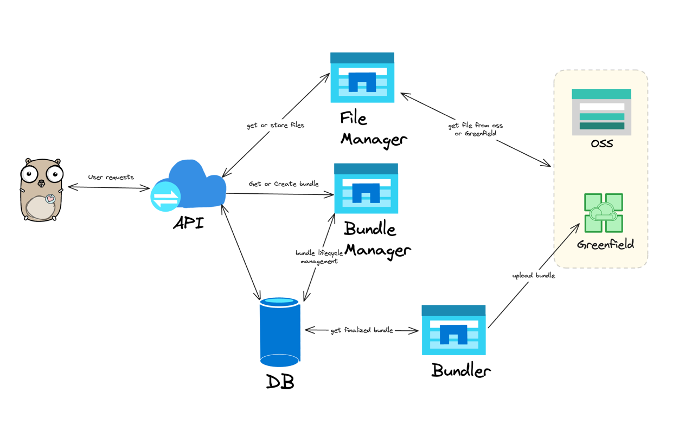

# Greenfield Bundle Service

## Overview

Greenfield Bundle Service is a service that allows users to upload small files to Greenfield in a more efficient way. 
It is designed to bundle small files together before uploading. This service will reduce storage space and costs caused
by small files while increasing the capacity of the entire network. It will also reduce the cost of uploading files to
Greenfield for users.

For bundle format information, please refer to [BEP-323](https://github.com/bnb-chain/BEPs/pull/323).

For go sdk of bundle format, please refer to [go-bundle](https://github.com/bnb-chain/greenfield-bundle-sdk).

## Architecture

The bundle service is composed of two parts: bundle service server and bundler:

* Bundle service server: a service that provides bundle service API for users to upload and download files in bundles.
  It also provides APIs for user to create and manage bundles manually like creating bundle, finalizing bundle and update
  bundle rules.
* Bundler: a service that bundles small files together before uploading to Greenfield and uploads the bundle to Greenfield.



## Build

### Build bundle service server

```shell
$ make build-server
```

### Build bundler

```shell
$ make build-bundler
```

## Run

### Run bundle service server

```shell
$ ./build/bundle-service-server --host 0.0.0.0 --port 8080 -c ./config/server/dev.json
```

### Run bundler

```shell
$ ./build/bundler --config-path ./config/bundler/dev.json
```

## Bundle Service Server API

The Bundle Service Server API provides several endpoints for managing and interacting with bundles. Here's a brief overview:

1. **Upload a single object to a bundle (`POST /uploadObject`):** This endpoint allows users to upload a single object to a bundle, requiring details like bucket name, file name, and etc.

2. **Upload a bundle (`POST /uploadBundle`):** This endpoint allows users to upload a bundle of objects, requiring details like bucket name, bundle name, and etc.

3. **Retrieve an object as a file from a bundle (`GET /view/{bucketName}/{bundleName}/{objectName}`):** This endpoint fetches a specific object from a given bundle and returns it as a file.

4. **Download an object as a file from a bundle (`GET /download/{bucketName}/{bundleName}/{objectName}`):** This endpoint allows users to download a specific object from a given bundle and returns it as a file.

5. **Query bundle information (`GET /queryBundle/{bucketName}/{bundleName}`):** This endpoint queries a specific object from a given bundle and returns its related information.

6. **Query bundling bundle information of a bucket (`GET /queryBundlingBundle/{bucketName}`):** This endpoint queries the bundling bundle information of a given bucket.

7. **Start a New Bundle (`POST /createBundle`):** This endpoint initiates a new bundle, requiring details like bucket name and bundle name.

8. **Finalize an Existing Bundle (`POST /finalizeBundle`):** This endpoint completes the lifecycle of an existing bundle, requiring the bundle name for authorization.

9. **Delete an Existing Bundle (`POST /deleteBundle`):** This endpoint deletes an existing bundle after object deletion on Greenfield.

10. **Get Bundler Account for a User (`POST /bundlerAccount/{userAddress}`):** This endpoint returns the bundler account for a given user.

11. **Set New Bundling Rules (`POST /setBundleRule`):** This endpoint allows users to set new rules or replace old rules for bundling, including constraints like maximum size and number of files.

For more detailed information about each endpoint, including required parameters and response formats, please refer to the `swagger.yaml` file.

### Authorization

The Bundle Service Server API uses digital signatures for authorization. The user's digital signature is required for 
certain API endpoints to authenticate the user and authorize the operation.

The digital signature is passed in the `Authorization` header of the HTTP request. The signature is generated by signing 
a specific message derived from the request with the user's private key. The message to sign is generated by 
the `GetMsgToSignInBundleAuth`, `TextHash` functions in the `http.go` file which you can refer to.

The server verifies the signature using the `VerifySignature` function, also in the `http.go` file. This function 
recovers the signer's address from the signature and compares it with the expected address. If the addresses match, 
the signature is verified and the request is authorized.

Here is an example of how to generate the signature in Go:

```go
import (
    "github.com/ethereum/go-ethereum/crypto"
    "github.com/node-real/greenfield-bundle-service/types"
)

// Assume `req` is the http.Request to be sent
messageToSign := types.GetMsgToSignInBundleAuth(req)
messageHash := TextHash(messageToSign)

signature, err := crypto.Sign(messageHash, privateKey) // privateKey is the user's private key
if err != nil {
    // handle error
}

// Add the signature to the Authorization header
req.Header.Add("Authorization", hex.EncodeToString(signature))
```

Please replace `privateKey` with the actual private key. 

### Steps to upload an object

1. Query the bundler account for the user using the `bundlerAccount` endpoint

2. Grant the bundler account the permission to upload objects to the user's bucket and grant fees to the bundler account,
you can refer to the below code:

```go
func grantFeesAndPermission() {
	ctx := context.Background()

	bucketActions := []permTypes.ActionType{permTypes.ACTION_CREATE_OBJECT}
	statements := utils.NewStatement(bucketActions, permTypes.EFFECT_ALLOW, nil, types.NewStatementOptions{})
	principal, err := utils.NewPrincipalWithAccount(bundlerAcc.GetAddress())
	if err != nil {
		util.Logger.Fatalf("fail to generate marshaled principal: %v", err)
	}
	txHash, err := gnfdClient.PutBucketPolicy(ctx, bucketName, principal, []*permTypes.Statement{&statements}, types.PutPolicyOption{})
	if err != nil {
		util.Logger.Fatalf("put policy failed: %v", err)
	}
	_, err = gnfdClient.WaitForTx(ctx, txHash)
	if err != nil {
		util.Logger.Fatalf("wait for grant permission tx failed: %v", err)
	}

	allowanceAmount := math.NewIntWithDecimal(1, 18)
	allowance, err := gnfdClient.QueryBasicAllowance(ctx, ownerAcc.GetAddress().String(), bundlerAcc.GetAddress().String())
	if err == nil {
		for _, coin := range allowance.SpendLimit {
			if coin.Denom == types2.Denom && coin.Amount.GTE(allowanceAmount) {
				return
			}
		}
		txHash, err = gnfdClient.RevokeAllowance(ctx, bundlerAcc.GetAddress().String(), types2.TxOption{})
		if err != nil {
			util.Logger.Warnf("revoke fee allowance failed: %v", err)
		}
		_, err = gnfdClient.WaitForTx(ctx, txHash)
		if err != nil {
			util.Logger.Warnf("wait for revoke allowance tx failed: %v", err)
		}
	}

	txHash, err = gnfdClient.GrantBasicAllowance(ctx, bundlerAcc.GetAddress().String(), allowanceAmount, nil, types2.TxOption{})
	if err != nil {
		util.Logger.Fatalf("grant fee allowance failed: %v", err)
	}
	_, err = gnfdClient.WaitForTx(ctx, txHash)
	if err != nil {
		util.Logger.Fatalf("wait for grant fee tx failed: %v", err)
	}
}
```

3. Upload the object to the user's bucket using the `uploadObject` endpoint

## Bundler

The bundler is a service that bundles small files together before uploading to Greenfield and uploads the bundle to Greenfield.
It will also manage the lifecycle of bundles, like finalizing the bundles.

It has two main functions:

1. finalize bundles: finalize the bundling bundles according to the bundling rules. It will finalize the bundles when the
   number of files in the bundle reaches the maximum number of files, or the size of the bundle reaches the maximum size, or
   the time of the bundle reaches the maximum time.

2. submit bundles: submit the finalized bundles to Greenfield. It will pack the finalized bundles and upload them to Greenfield.